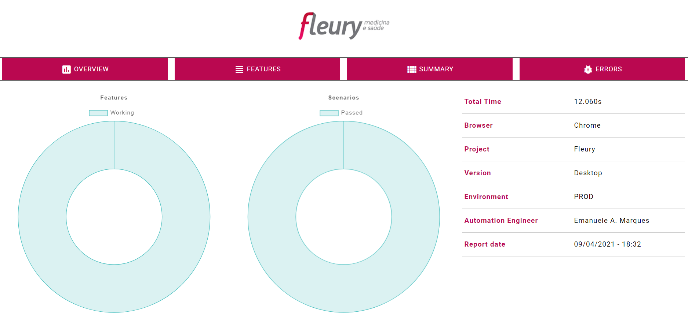

# [Fleury]  QA Automação WEB

>Desafio técnico de automação web, com testes e2e

<p align="center">
  
</p>

---

### Tópicos

:small_blue_diamond: [Funcionalidades](#funcionalidades-pushpin)

:small_blue_diamond: [Validações](#validações-crystal_ball)

:small_blue_diamond: [Stack](#stack-rocket)

:small_blue_diamond: [Pré-requisitos](#pré-requisitos-link)

:small_blue_diamond: [Instalação](#instalação-computer)

:small_blue_diamond: [Como rodar a automação](#como-rodar-a-automação-gear)

:small_blue_diamond: [Reports](#reports-file_folder)

---

### Funcionalidades :pushpin:

:heavy_check_mark: Acessar a categoria **Unidades** através da Home do site

:heavy_check_mark: Escolher entre 1 a 3 opções de Facilidade

:heavy_check_mark: Selecionar o primeiro resultado da busca

:heavy_check_mark: Validar o nome da Unidade na nova página

---

### Validações :crystal_ball:

Com o objetivo de ter um teste mais assertivo (levando em conta que a validação solicitada era muito rasa), foram realizadas validações adicionais:
- Ao selecionar as facilidades, é validado em todos os cards (já filtrados) se possuem as facilidades selecionadas (caso algum não possua, o teste falha mostrando qual facilidade não foi encontrada);
- Ao abrir o card, são comparadas todas as informações presentes no card com as informações presentes na página da Unidade (caso alguma esteja incorreta (ou ausente), o teste falha mostrando qual informação está incoerente (e o que tem no lugar onde ela deveria estar));
- Desenvolvido o método `greenify` para destacar as interações na aplicação.
---

### Stack :rocket:
- Ruby: linguagem de fácil entendimento, com uma baixa curva de aprendizado. Tem suporte para automações WEB, API e Mobile (utilizando appium);
- Capybara: DSL com suporte integrado ao Selenium;
- Cucumber: suporta implementação de especificações em formato estruturado usando Gherkin [aqui estamos inserindo o BDD :)];
- Report: foi gerado um report utilizando a gem `report_builder`, com customizações em um arquivo CSS com cores e logo da empresa;
- Page Objects Model: utilizando poderes da orientação a objetos como abstração, encapsulamento e segmentação de responsabilidades, temos um ganho na organização e reaproveitamento de código nas páginas;
- Site Prism: gem para melhorar a implementação do Page Objects Model;
- Selenium Webdriver: gem que possibilita as interações através do chromedriver com o navegador;
- Rsec: gem que possibilita usar asserções de forma mais intuitiva;
- CSS Selector: além de ter maior compatibilidade que o xpath nos navegadores, quando usado de forma correta, evita que alterações em outros elementos impactem no elemento mapeado.
---

### Pré-requisitos :link:


- [Git](https://git-scm.com) [baixar última versão estável]
- [Ruby](https://rubyinstaller.org/downloads) [baixar a versão recomendada (2.7.2)]
- [Chromedriver](https://chromedriver.chromium.org/downloads) [baixar a de acordo com a versão do navegador]

---

### Instalação :computer:

- Git\
Instalação padrão
- Ruby\
Instalação padrão
- Chromedriver\
Descompactar e inserir o arquivo `chromedriver.exe` dentro da pasta bin, no diretório de instalação do Ruby
- Bundler\
Rodar o seguinte comando para atualização do bundler: `gem install bundler`
- Gems utilizadas\
Com o repositório devidamente clonado, entrar no diretório raiz do projeto com o terminal e rodar o seguinte comando para instalação das gems do projeto: `bundle install`

---

### Como rodar a automação :gear:

Com as gems instaladas, ainda dentro do diretório raiz do projeto, executar o comando:
```bash
cucumber -t @selecionar_facilidades
```

### Reports :file_folder:

Ao finalizar a execução, o report HTML `fleury-automation-report` será gerado na pasta `reports`.
